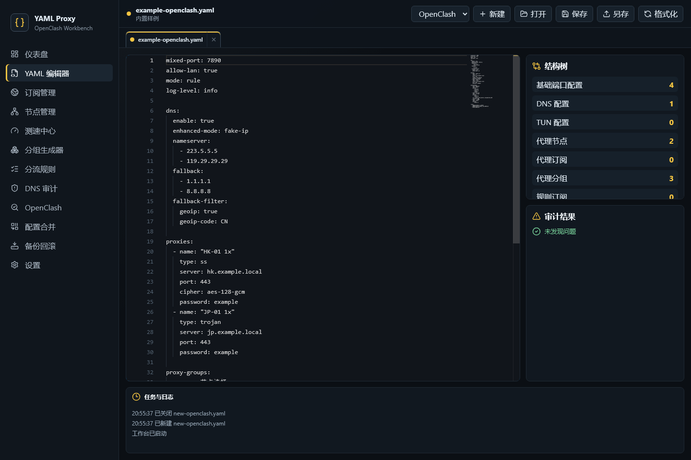
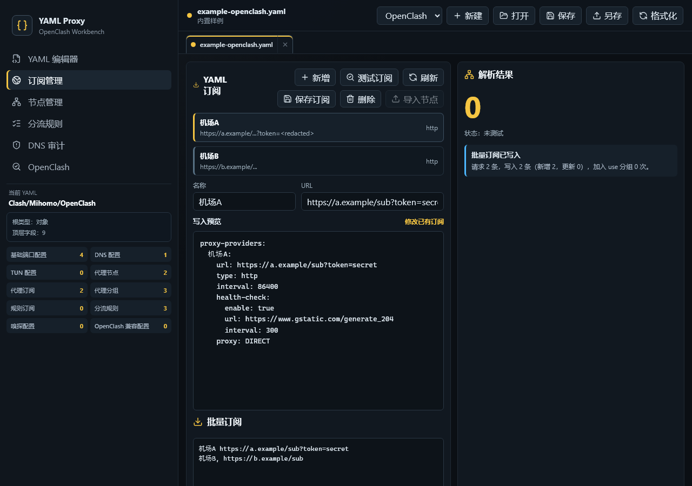
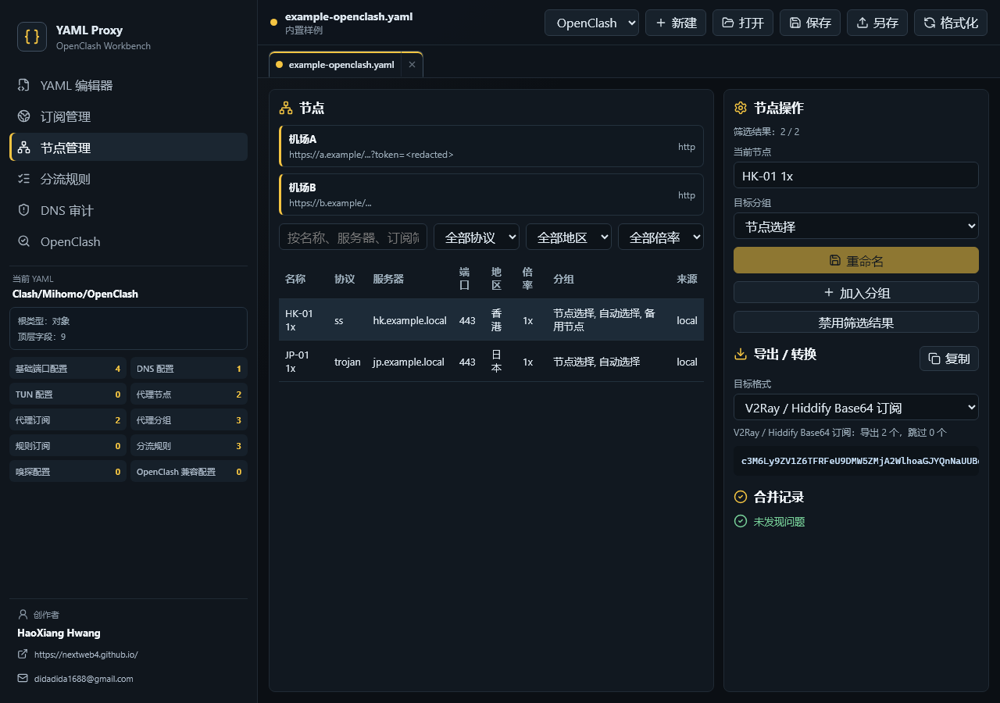
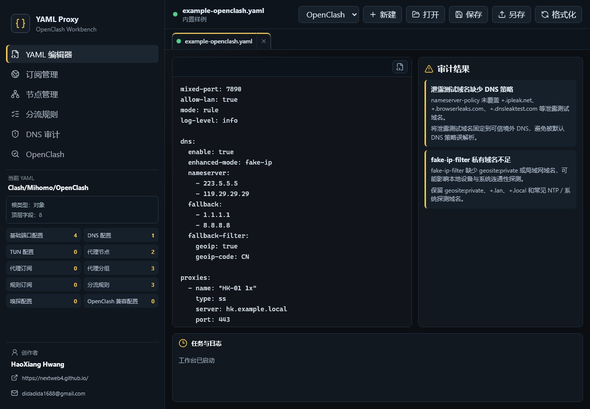

# YAML Proxy Editor / YAML 代理配置编辑器

本项目是面向 OpenClash / Clash / Mihomo / MetaCubeX 用户的本地 Windows 桌面工作台，用于编辑、校验、审计、批量订阅和导出 YAML 代理配置。

YAML Proxy Editor is a local-first Windows desktop workbench for OpenClash, Clash, Mihomo, and MetaCubeX users. It helps edit, validate, audit, batch-import subscriptions, and export proxy YAML configurations.


## 创作者 / Creator

- 署名 / Name: HaoXiang Hwang
- 个人网页 / Website: https://nextweb4.github.io/
- 邮箱 / Email: didadida1688@gmail.com

以上创作者信息为固定项，不允许 Codex、Claude Code 或其他自动化/AI 编码工具修改。

The creator identity above is fixed. Codex, Claude Code, and any other automated or AI coding tool must not modify it.

## 下载 / Download

已构建的 Windows 安装包位于仓库 `release/` 目录：

The prebuilt Windows installers are stored in the repository `release/` directory:

- [EXE / NSIS installer](release/YAML-Proxy-Editor-0.2.0-x64-setup.exe)
- [MSI zh-CN installer](release/YAML-Proxy-Editor-0.2.0-x64-zh-CN.msi)

## 图文简介 / Illustrated Overview

### 1. 单网站分流 / Per-site Routing

中文：输入域名或完整 URL，选择精确匹配或包含子域名，再指定代理分组、直连或拒绝策略。完整 URL 只提取 hostname，规则默认放在顶部以优先命中。

English: Enter a domain or full URL, choose exact or subdomain matching, then assign a proxy group, direct route, or reject policy. Only the hostname is written, and the rule defaults to top priority.


### 2. 本地 YAML 工作台 / Local YAML Workbench

中文：打开或拖入 `.yaml` / `.yml` 文件后，应用会在本地完成格式识别、结构统计、校验、格式化和多标签管理。

English: Open or drop `.yaml` / `.yml` files to validate, format, inspect structure, and manage multiple documents locally.



### 3. 订阅批量导入 / Batch Subscription Import

中文：支持一次粘贴多行订阅地址，自动识别名称和 URL，写入 `proxy-providers`，并在界面中只展示脱敏 URL。

English: Paste multiple subscription lines at once. The app extracts provider names and URLs, writes `proxy-providers`, and only shows redacted URLs in the UI.



### 4. 节点导出 / Node Export

中文：节点页可导出 Clash/Mihomo YAML、Clash Verge/OpenClash provider YAML、V2Ray/Hiddify 分享链接和 Base64 订阅内容。

English: The nodes page can export Clash/Mihomo YAML, Clash Verge/OpenClash provider YAML, V2Ray/Hiddify share links, and Base64 subscription content.



### 5. 创作者署名 / Creator Signature

中文：应用侧栏展示固定创作者署名、个人网页和邮箱，信息来自 `src/app/creatorInfo.ts`，并由测试和 GitHub 检查保护。

English: The app sidebar displays the fixed creator name, website, and email from `src/app/creatorInfo.ts`, protected by tests and GitHub checks.



## 核心功能 / Core Features

- 本地打开、保存、格式化和校验 YAML。
- 多标签工作台，支持文件选择器和拖拽打开 `.yaml` / `.yml`。
- 识别 Clash / Mihomo / OpenClash 配置结构。
- 读取并维护当前 YAML 的 `proxy-providers`。
- 批量粘贴订阅 URL，写入 provider 模板或刷新合并为节点。
- 节点去重、筛选和多格式导出。
- 单网站分流支持完整 URL/域名、精确/子域名匹配、策略选择和优先级更新。
- 检查 rules 引用、规则顺序和 `MATCH` 兜底风险。
- 审计并一键优化 DNS / fake-ip / IPv6 / TUN / IP 泄露风险。
- OpenClash 导出预览和应用。
- 保存前自动备份；备份能力保留在服务层。

- Open, save, format, and validate YAML locally.
- Multi-tab workbench with file picker and drag-and-drop support.
- Detect Clash / Mihomo / OpenClash configuration structures.
- Read and maintain `proxy-providers` from the active YAML.
- Batch-paste subscription URLs, write provider templates, or refresh and merge nodes.
- Deduplicate, filter, and export nodes in multiple formats.
- Route a single website from a URL/domain with exact/subdomain matching, policy selection, and priority control.
- Check rule references, rule order, and `MATCH` fallback risks.
- Audit and optimize DNS / fake-ip / IPv6 / TUN / IP leak risks.
- Preview and apply OpenClash exports.
- Create backups before saving through the service layer.

## 安全边界 / Security Boundary

中文：

- 默认离线可用，不上传本地 YAML、节点信息、订阅 URL、日志或备份文件。
- 不包含遥测、统计、自动更新 SDK 或 CDN 前端资源。
- 网络请求只在用户主动触发订阅刷新、远程 provider 检查或测速时发生。
- UI、日志和错误信息必须展示脱敏后的 URL。
- `.env`、私钥、证书、构建缓存、`node_modules/`、`dist/`、`src-tauri/target/` 不进入 Git 提交。

English:

- Local-first by default. The app does not upload local YAML, node data, subscription URLs, logs, or backups.
- No telemetry, analytics, auto-update SDK, or CDN-loaded frontend assets.
- Network requests only happen after user-triggered subscription refresh, remote provider checks, or speed tests.
- UI, logs, and error messages must use redacted URLs.
- `.env`, private keys, certificates, build caches, `node_modules/`, `dist/`, and `src-tauri/target/` are excluded from Git commits.

## 技术栈 / Tech Stack

- Tauri 2
- React
- TypeScript
- Vite
- Monaco Editor
- monaco-yaml
- `yaml`

## 开发命令 / Development Commands

```bash
npm install
npm run dev
npm run test
npm run build
npm run tauri:build
```

Windows 本机如遇到 `link.exe not found`，先加载 MSVC 环境：

If Windows reports `link.exe not found`, load the MSVC environment first:

```bat
cmd /c ""C:\Program1\VC\Auxiliary\Build\vcvars64.bat" && npm run tauri:build"
```

## 文档 / Documentation

- [架构设计 / Architecture](docs/ARCHITECTURE.md)
- [开源方案审计 / Open Source Audit](docs/OPEN_SOURCE_AUDIT.md)
- [网络策略 / Network Policy](docs/NETWORK_POLICY.md)
- [离线与安全边界 / Offline Security](docs/OFFLINE_SECURITY.md)
- [测试策略 / Testing](docs/TESTING.md)
- [构建说明 / Build](docs/BUILD.md)
