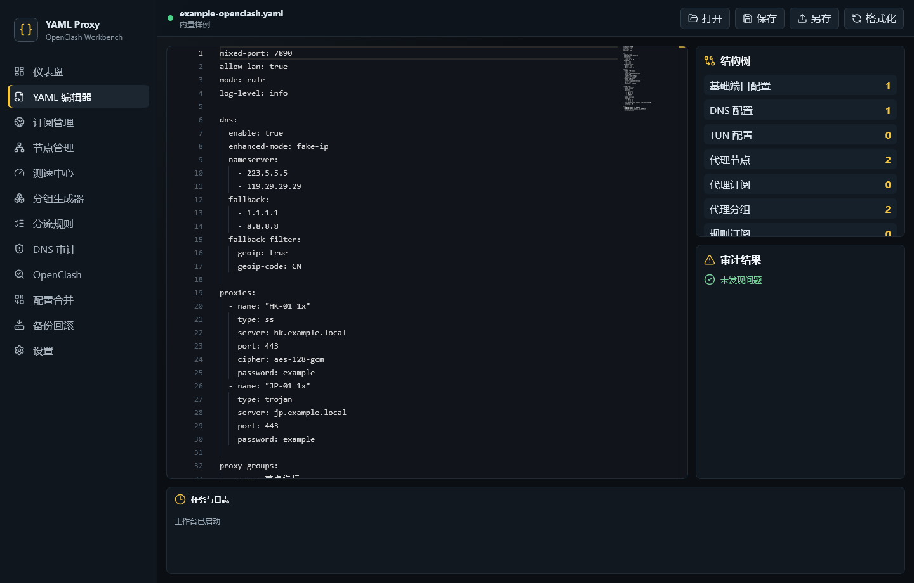
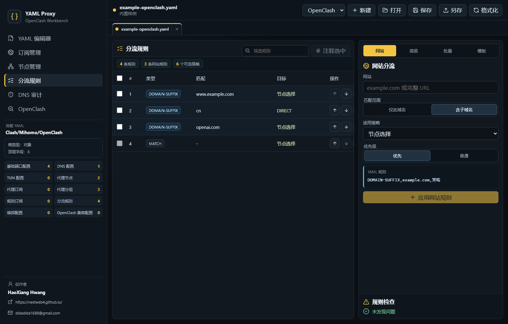

[English](README.md) | [简体中文](README.zh-CN.md) | [日本語](README.ja.md)

# YAML 代理配置编辑器

一款本地优先的 Windows 桌面工作台，用于编辑、审计、导入和导出 Clash、OpenClash 与 Mihomo YAML 配置。

[](https://github.com/NextWeb4/yaml-proxy-editor/commits/main)
[](https://github.com/NextWeb4/yaml-proxy-editor)
[](https://github.com/NextWeb4/yaml-proxy-editor)




## 核心能力

- 在本机打开、保存、格式化和校验 `.yaml` / `.yml` 文件。
- 通过多标签页、文件选择器和拖放管理多个文档。
- 识别 Clash、Mihomo 和 OpenClash 配置结构。
- 读取和修改 `proxy-providers`，批量导入订阅，并在用户主动操作后刷新节点。
- 规范化、去重、筛选、分组并导出 Clash/OpenClash、V2Ray 和 Hiddify 所需节点。
- 添加、导入、排序、注释和删除规则，同时保持 `MATCH` 兜底顺序。
- 从域名或完整 URL 创建单网站分流规则，支持精确/子域名匹配与策略选择。
- 审计规则、DNS/fake-IP、OpenClash 兼容性、远程 provider 响应和常见配置风险。
- 切换中英文界面，并在本地 `localStorage` 的 `yaml-proxy-editor.language` 中保存选择。

## 单网站分流

输入完整 URL 时，只把规范化后的 hostname 写入 YAML；path、query、用户名和密码会被丢弃，填写网站本身不会发起网络请求。网站规则默认放在 `rules` 顶部；普通优先级会放到 `MATCH` 之前。相同类型和 hostname 的既有规则会更新目标，而不是重复添加。



## 下载

仓库包含以下 0.2.0 Windows 安装包：

- [NSIS 安装程序](release/YAML-Proxy-Editor-0.2.0-x64-setup.exe)
- [中文 MSI 安装包](release/YAML-Proxy-Editor-0.2.0-x64-zh-CN.msi)

## 开发

项目使用 npm 与 `package-lock.json`，技术栈包括 React 19、TypeScript、Vite、Vitest、Tauri 2 和 Rust。在 Windows 构建 Tauri 桌面包还需要可用的 Rust/MSVC 工具链。

```bash
npm install
npm run dev
```

`npm run dev` 会把 Vite 绑定到 `127.0.0.1:1420`。开发桌面壳时运行：

```bash
npm run tauri:dev
```

## 测试与构建

```bash
npm run test
npm run build
npm run tauri:build
```

- `npm run test` 运行 `tests/` 下的 Vitest 测试。
- `npm run build` 执行 TypeScript 项目构建并生成 Vite 前端产物。
- `npm run tauri:build` 先构建前端，再生成配置中的 NSIS 和 MSI 安装包。

如果 Tauri 构建提示缺少 `link.exe`，请在已加载 Visual Studio C++ 构建环境的终端中执行。

## 架构

| 路径 | 职责 |
| --- | --- |
| `src/App.tsx` | 应用外壳、页面状态和服务组合 |
| `src/components/editor/` | 懒加载 Monaco YAML 编辑器 |
| `src/services/yaml/` | YAML 解析、格式化、校验和模板 |
| `src/services/subscription/` | 订阅解析、刷新、选择和导出 |
| `src/services/nodes/` | 节点规范化、筛选、分组和导出 |
| `src/services/rules/` | 规则解析、编辑、模板和网站分流 |
| `src/services/config/` | provider 与 DNS/fake-IP/TUN 优化 |
| `src/services/openclash/` | OpenClash 兼容检查和导出 |
| `src/services/provider_check/` | 用户主动触发的远程 provider 检查 |
| `src/services/desktop/` | 浏览器/Tauri 文件与订阅桥接 |
| `src-tauri/src/` | 原生文件、备份、订阅命令和错误处理 |
| `tests/` | Vitest 回归测试和 YAML fixtures |

前端复用现有 `yaml`、`monaco-yaml`、`json-diff-ts` 和 `lucide-react`。只有用户启用完整编辑器后才加载 Monaco，避免大型编辑器和 worker chunk 阻塞首屏工作台。

## 本地与联网边界

- 不会自动上传本地 YAML、节点、订阅 URL、日志或备份。
- 前端不包含遥测、分析、自动更新 SDK 或 CDN 运行时资源。
- 仅在用户主动刷新订阅、检查远程 provider 或测速时访问网络。
- 用户 URL 可能包含秘密；错误和日志必须脱敏完整 URL、path、query、用户名与密码。
- 打开、格式化、校验、审计、编辑和保存本地文件必须保持离线。
- 即使宽松分析能够列出部分结构，保存前的严格校验仍必须阻止重复 key。

更多说明见 [`docs/QUICKSTART.md`](docs/QUICKSTART.md)、[`docs/ARCHITECTURE.md`](docs/ARCHITECTURE.md)、[`docs/NETWORK_POLICY.md`](docs/NETWORK_POLICY.md)、[`docs/OFFLINE_SECURITY.md`](docs/OFFLINE_SECURITY.md)、[`docs/TESTING.md`](docs/TESTING.md) 和 [`docs/BUILD.md`](docs/BUILD.md)。

## 创作者

- HaoXiang Hwang
- [didadida1688@gmail.com](mailto:didadida1688@gmail.com)
- [https://nextweb4.github.io/](https://nextweb4.github.io/)

创作者身份是固定项目值，应用、package、Rust、安装包、测试和 workflow 元数据必须保持一致。

## 许可证

当前仓库没有 `LICENSE` 文件。复用或分发前必须确认原始授权来源和适用范围；依赖项各自拥有许可证，并不能替代项目本身的授权。
